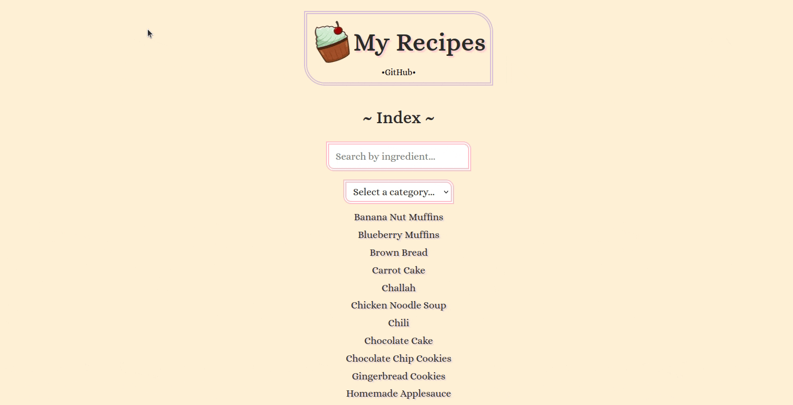

# Recipe App 🧁



## Description
Recipe App is a full stack Next.js React app that holds a variety of recipes with categories like Bread, Cake, Soup, Cookie, and Breakfast, and with features such as ingredient-based search and category filtering.

## Features
- **Search Recipes**: Users can search for recipes by ingredients.
- **Category Filtering**: Explore recipes based on categories like Bread, Cake, Soup, etc.
- **Responsive Design**: The app is fully responsive and accessible on various devices.
- **Printable Recipes**: Recipes can be printed in a simple, reader-friendly format.

## Technologies Used
- **React (Typescript)**: For building the front-end.
- **Next.js**: Server-side rendering and routing.
- **CSS**: For styling components.

## Setup and Installation
1. **Clone the Repository**
```bash
git clone https://github.com/amy-enn/recipes-app
cd recipes-app
```

2. **Install Dependencies & Run Locally**
```bash
npm install
npm run dev
```

The app will be available at `localhost:3000` in your browser.

## Usage

* Click on any recipe to view detailed instructions and ingredients.
* Navigate through the categories using the dropdown menu.
* Use the search bar to find recipes by ingredients. 
* Printer-friendly versions are available for each recipe.

## Recipe Data (JSON)

The app currently uses JSON files to store the recipes. Each recipe in the JSON file follows the same format and includes the recipe name, ID, category, list of ingredients, cooking instructions, and a short description.  I created the data format and properties, and the recipes themselves were generated using an LLM (they have NOT been taste-tested lol)

## API Routes

The app includes 2 Next.js API routes that let the front-end display the recipes.

- `/api/recipes`: Retrieves the full list of recipes.
- `/api/recipes/[id]`: Retrieves a specific recipe based on its ID.


## Future Features

* migrating recipe data (and API routes) from JSON into database 
* creating an admin page with login for adding/editing/deleting a recipe
* ability to "favourite" recipes or leave a tasting note
* recipe "name" search (OR change the ingredient search to an overall search)
